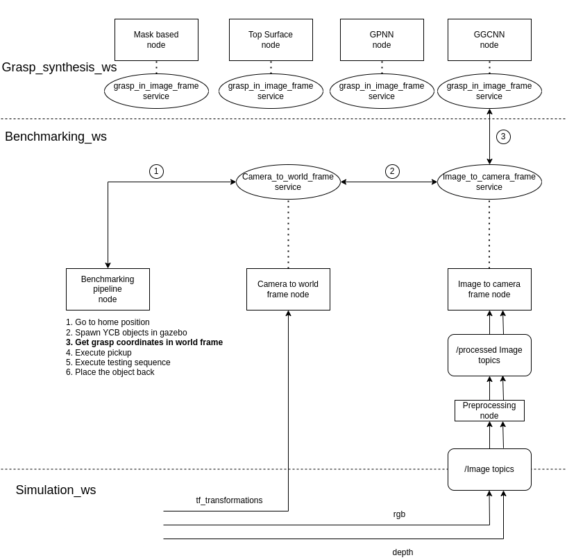

# Towards More Robust and Reliable Vision-Based Grasping: A Benchmarking Study

This is the official repository for **A Benchmarking Study of Vision-based Robotic Grasping Algorithms**
[Youtube](https://www.youtube.com/watch?v=hmgh5JGP-Ak)


<!---
#### Video Demo of the benchmarking experiemnts
<a href="https://youtu.be/hmgh5JGP-Ak" target="_blank" rel="noopener noreferrer">
    
-->

## General Setup

<details>
  <summary> <b>With docker</b></summary>

Make sure you have *docker* installed on your system. Refer to the official docker setup [instructions](https://docs.docker.com/engine/install/) if you do not have docker installed.

Pull the docker image for this project using

    docker pull vinayakapoor/grasping_benchmarking_image:ros1_v1
    
#### Building your own docker image
To build your own docker image, clone the repo and use `docker build`

    git clone https://github.com/vinayakkapoor/vision_based_grasping_benchmarking.git
    cd vision_based_grasping_benchmarking
    docker build -t grasping_benchmarking_image:ros1_v2 .
You might need to add `sudo` depending on how your docker daemon is configured

    sudo docker build -t grasping_benchmarking_image:ros1_v2 .
</details>

**Without Docker**

PREREQUISITES: ROS Noetic

Clone the repo and run the setup script

    git clone https://github.com/vinayakkapoor/vision_based_grasping_benchmarking.git
    cd vision_based_grasping_benchmarking/grasping_benchmarking_suite/
    chmod +x benchmark_grasping_tmux.sh benchmark_grasping_gnome_terminal.sh setup.sh
    # Setup and build the grasping_benchmarking directory
    ./setup.sh -r ~/grasping_benchmarking                 # Change the install directory if required

<details>
  <summary><b>But what does setup.sh do?</b></summary>
    The bash file appropriately installs all the necessary requirements and sets up the following structure -

```
grasping_benchmarking
├── benchmark_grasping.sh
├── benchmarking_ws
│   ├── build
│   ├── devel
│   ├── logs
│   └── src
├── grasp_algo_ws
│   ├── build
│   ├── devel
│   ├── logs
│   └── src
├── panda_sim_ws
│   ├── build
│   ├── devel
│   ├── logs
│   └── src
└── venv
    ├── bin
    ├── include
    ├── lib
    ├── lib64 -> lib
    ├── pyvenv.cfg
    └── share

```
</details>


## Running Benchmarking

<details>
  <summary><b>With Docker</b></summary>

  Run the image using

  ```sh
  xhost +
  sudo docker container run --rm -e DISPLAY=$DISPLAY --net host -v /tmp/.X11-unix:/tmp/.X11-unix -it vinayakapoor/grasping_benchmarking_image:ros1_v1
  ```

Then run the container using
```sh
./benchmark_grasping_tmux.sh
```

Run `xhost -` when you're done

Change the grasping algorithm using `vim ./benchmarking_ws/src/benchmarking_vision_based_grasping/benchmarking_grasp/config/configuration.yaml` and changing the _grasp_in_image_frame_ parameter 

</details>


**Without Docker**

    cd ~/grasping_benchmarking                            # Change to the install directory
    ./benchmark_grasping_tmux.sh
    # ./benchmark_grasping_gnome_terminal.sh              # If unfamiliar with tmux navigation

## Usage
To better manage the terminals, a tmux script is provided which streamlines debugging and testing. It is recommended to use this script.
Use `./benchmark_grasping_tmux.sh`

If unfamiliar with tmux, ```sh ./benchmark_grasping_gnome_terminal.sh``` launches all the necessary commands in gnome terminal itself for ease of use.
### TMUX Navigation

| Command               | Action                          |
|-----------------------|---------------------------------|
| `Ctrl+b` → `w`        | Window selection                |
| `Ctrl+b` + Arrow Keys | Pane navigation                 |
| `Ctrl+b` → `:` → `kill-session` | Terminate session          |

*For detailed TMUX guidance, consult [this quick reference](https://hamvocke.com/blog/a-quick-and-easy-guide-to-tmux/).*
[Tmux cheatsheets](https://github.com/ctu-mrs/mrs_cheatsheet)


### Changing the configuration

All the rosparams are loaded from `configuration.yaml` file in `grasping_benchmarking_suite/benchmarking_vision_based_grasping/benchmarking_grasp/config`

Change the `grasp_in_image_frame:` to the provided values to switch the algorithm being used to generate grasps on the fly.

**Note**: The wooden texture described in the paper was created by printing a wooden pattern and applying it to the grasping surface. For reproducibility, we provide the same pattern at `/media/wooden_pattern.jpg` 


## Architecture for grasp generation 



## Helpful Features

1. **Add custom objects to benchmark in the simulation**

Custom _sdf_ models of the objects can be added to `vision_based_grasping_benchmarking/grasping_benchmarking_suite/benchmarking_vision_based_grasping/pick_and_place/urdf/objects/`, with the format <object_name dir>/<object_name>.sdf. 

Make sure to edit the `https://github.com/vinayakkapoor/vision_based_grasping_benchmarking/blob/master/grasping_benchmarking_suite/benchmarking_vision_based_grasping/benchmarking_grasp/config/benchmarking_experiments.yaml` to include your custom object in the experiments!

For example, add a folder named "hammer" to the _objects folder_ and put your "hammer.sdf" file in it. Then edit the _benchmarking_experiments.yaml_ file to include "hammer"

2. **Add custom grasping algorithms to benchmark**

A template algorithm is provided in the `grasping_benchmarking_suite/grasp_synthesis`. Implement the predict function in the `service_server.py` for your custom algorithm, and all the ROS part is taken care of by the script!

3. **Add custom gripper to benchmark**

The configurations.yaml file provides several parameters to extend the benchmarking framework to a variety of grippers - 

_gripper_height_: The code removes noisy ground-plane values in the depth image by adjusting depth values based on the gripper height. Specifically, it modifies depths greater than a certain threshold (calculated based on the gripper's height) to ensure the grasping point is sufficiently above the ground plane

_gripper_width_: The width of the gripper is used to adjust the size of the bounding box (rectangular region) around a predicted grasp. This ensures that the grasp region is appropriately scaled to the gripper's dimensions, allowing for more accurate depth and pose calculations.

_gripper_offset_: The gripper_offset is used to adjust the height at which the gripper operates. This ensures that the robot's gripper is at an appropriate height relative to the object being picked or placed.


## Troubleshooting

1. **Problems with robot movement in Gazebo / MoveIt Commander errors in `computeCartesianPath()`:**

   The `computeCartesianPath()` function in MoveIt Commander was recently updated (see [moveit/pull/3618](https://github.com/moveit/moveit/pull/3618)). Please upgrade the package using:

   ```sh
   sudo apt install --only-upgrade ros-noetic-moveit-commander
   ```

   Consider upgrading other ROS packages if the issues persist.

   <details>
   <summary>What if I do not want to upgrade the packages?</summary>

   Navigate to:
   ```sh
   cd ./grasping_benchmarking_suite/panda_simulation/moveit_adapter/src/moveit_adapter_module/
   ```

   Change `False` to `0.0` in _eef_control.py_:

   ```python
   (plan, _) = move_group.compute_cartesian_path(
       cartesian_points,  # waypoints to follow
       0.01,  # eef_step
       0.0)  # Changed from False to 0.0
   ```
   </details>

2. **If the `catkin build` hangs, update this line in `setup.sh`**
```bash
catkin build -j6
```
3. **Problems with GUI when using docker**

    This [stackoverflow thread](https://stackoverflow.com/questions/40658095/how-to-open-ubuntu-gui-inside-a-docker-image) was incredibly helpful for troubleshooting


